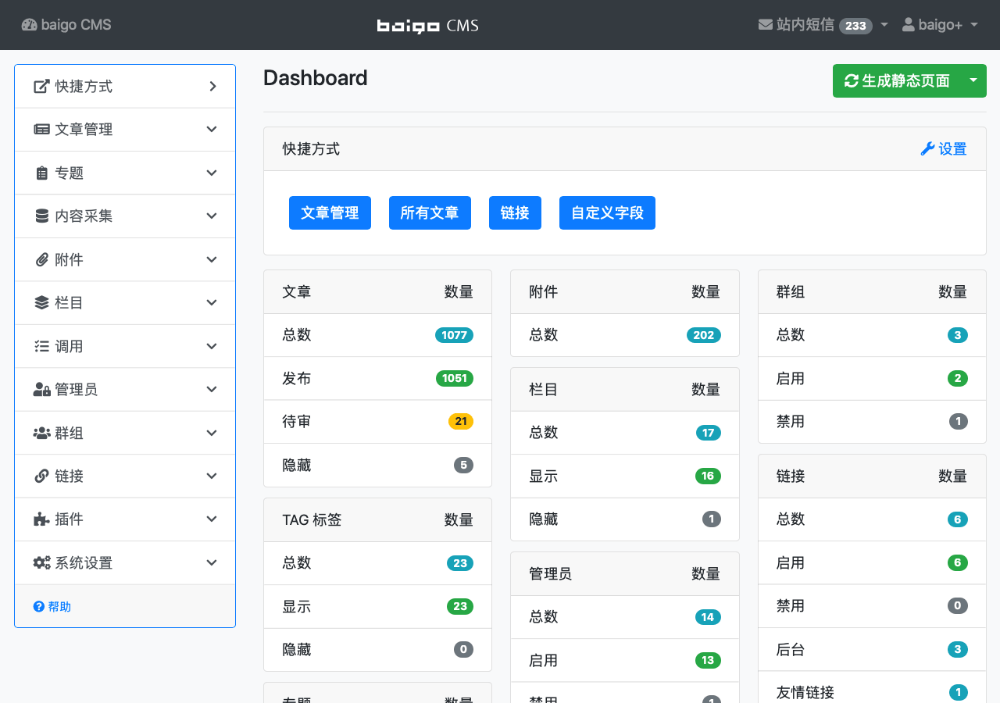

## 后台概述

baigo CMS 的管理后台地址为 http://server/index.php/console，在登录界面输入用户名、密码、验证码登录。进入后台后的界面如下：

{.img-fluid .bg-img}

在纯静态模式下，右上角将会显示“生成静态页面”菜单。

----------

##### 功能模块说明

可以通过左侧菜单进入响应管理模块，右上角的用户菜单可以进行修改密码、修改个人信息等操作。

| 菜单 | 描述 |
| - | - |
| 快捷方式 | 管理员可以自定义快捷方式，可以通过 Dashboard 中的 `设置` 链接进入设置功能 |
| 文章管理 | 文章是指网站发布的内容，比如新闻、公告等，您也可以将文章视为信息、产品等。 |
| 专题 | 专题是指若干文章的集合 |
| 内容采集 | baigo CMS 系统通过技术手段，将指定网站的内容采集到本系统。 |
| 附件 | 可以在此上传图片、附件，管理上传过的图片、附件。 |
| 栏目 | 栏目管理 |
| 调用 | 某些时候，网站的特定位置需要显示符合条件的信息，如：排行榜、最新发布、指定栏目的最新消息等。 |
| 管理员 | 管理员管理 |
| 群组 | 群组是指网站管理员按照特定的权限形成的组合 |
| 链接 | 链接是一项比较特殊的功能，分为“后台”、“友情链接”、“自动链接”三种类型，“后台”类型会在后台主菜单的“链接”中增加链接，“友情链接”用于友情链接功能，“自动链接”会将指定的文章内容中匹配的关键词设置成链接，一般用作广告。 |
| 插件 | 插件的安装、管理、设置等功能 |
| 系统设置 | 您可以在此设置网站名称、时区、各类格式等。 |